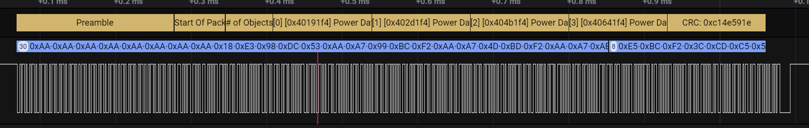
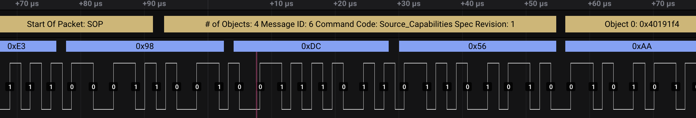
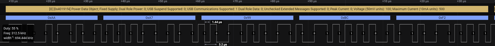
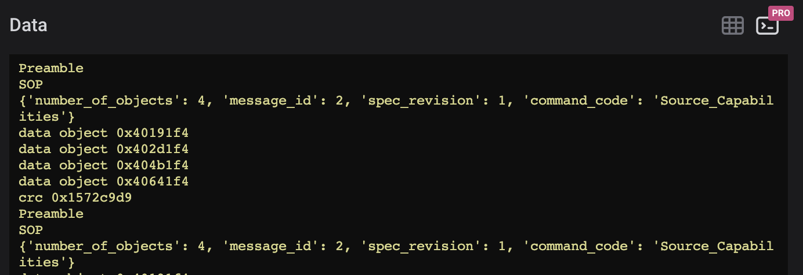

# USB PD (Biphase Mark Code)

Note: It might not be possible to record the USB PD CC signal directly with a Saleae device, because of the voltage thresholds required. It may be necessary to place a comparator in front of the USB PD signal. Specifically, the signal should be interpreted as idle high, so that the very first bit is properly decoded as a zero. An incorrect threshold voltage may cause the first bit to be skipped, however support for this could probably be added in this extension.

This HLA is based on the USB PD 3.0 specification: https://www.usb.org/document-library/usb-power-delivery

## Instructions

1. Record the USB PD signal (CC).
2. Add the Saleae Manchester analyzer with the following settings
   - Mode: Bi-Phase Mark Code (FM1)
   - Bit Rate: 300000
3. add the USB PD (Biphase Mark Code) Analyzer, and select the Manchester analyzer as the input

### This decoder is not yet complete!

It still needs:

- Decode all vendor data objects. (vendor header is supported)
- extended header and data block decoding
- crc validation
- Testing! Only source capabilities fixed supply data objects have been decoded. all other data object decoding hasn't been tested, and might not work.

Please report problems on github, and attach sample captures

### Examples
Example Packet

Example Header

Example Data Object

Example Data Table (not yet released in Logic 2 SW)

Example Terminal

